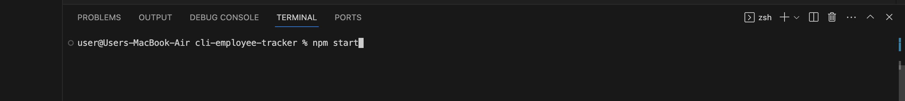

# CLI Employee Tracker

## Description
This is a Node JS application that allows you to create a database for employee information regarding the the name of the employee, their managers, the departments, salary and more. This app was created using inquirer to promot questions in the cli, as well as MySQL to query to a database to save and persist all of the data.

## Installation
run npm start in the terminal  

## Links
Link to GitHub repository: https://github.com/Rilwan0410/cli-employee-tracker  
Link to video walkthrough: 